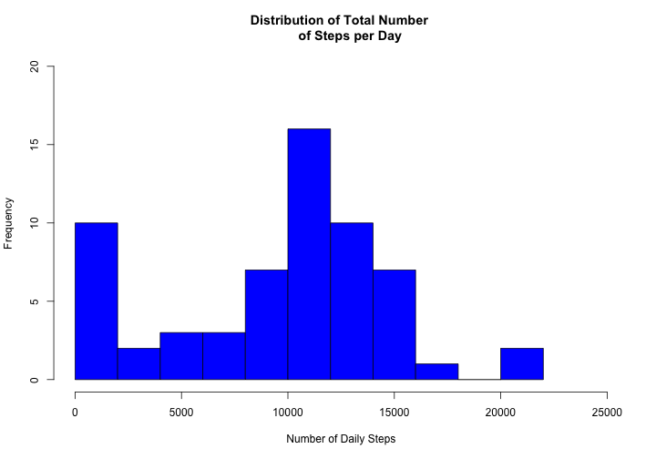

Salvino A. Salvaggio - June 2014

Reproducible Research: Peer Assessment 1
=============================================================

### Background
It is now possible to collect a large amount of data about personal movement using activity monitoring devices (Fitbit, Nike Fuelband, Jawbone Up, etc.). These type of devices are part of the "quantified self" movement, a group of enthusiasts who take measurements about themselves regularly to improve their health, to find patterns in their behavior, or because they are tech geeks. But these data remain under-utilized both because the raw data are hard to obtain and there is a lack of statistical methods and software for processing and interpreting the data.


### Loading and preprocessing the data
The dataset for this assignment is available at this link: [Activity monitoring dataset](https://d396qusza40orc.cloudfront.net/repdata%2Fdata%2Factivity.zip)

* download it
* unzip it
* save the 'activity.csv' file in your R Workspace

Then pre-process the data:

```r
# Use read.csv() to load the data into R
activity <- read.csv('activity.csv', header=T)
head(activity)
```

```
##   steps       date interval
## 1    NA 2012-10-01        0
## 2    NA 2012-10-01        5
## 3    NA 2012-10-01       10
## 4    NA 2012-10-01       15
## 5    NA 2012-10-01       20
## 6    NA 2012-10-01       25
```

```r
str(activity)
```

```
## 'data.frame':	17568 obs. of  3 variables:
##  $ steps   : int  NA NA NA NA NA NA NA NA NA NA ...
##  $ date    : Factor w/ 61 levels "2012-10-01","2012-10-02",..: 1 1 1 1 1 1 1 1 1 1 ...
##  $ interval: int  0 5 10 15 20 25 30 35 40 45 ...
```
The variables 'date' and 'interval' are not of the right class, so they need to be 
converted

```r
# Convert the 'date' variable to a date class
activity$Date <- as.Date(activity$date, "%Y-%m-%d")

# Convert the 'interval' variable to a factor
activity$interval <- as.factor(activity$interval)
```


### What is mean total number of steps taken per day?


```r
# tapply to compute the total, mean and median number of steps per day
# Missing values can be ignored
totalSteps <- tapply(activity$steps, activity$date, sum, na.rm = TRUE)
hist(totalSteps, breaks = 12, col = "blue", main = "Distribution of Total Number 
     of Steps per Day", ylim= c(0,20), xlim= c(0,25000), xlab = "Number of Daily Steps")
```

 

Median and mean of steps per day:

```r
summary(totalSteps)[3:4]
```

```
## Median   Mean 
##  10400   9350
```

### What is the average daily activity pattern?

```r
# Compute the average number of steps taken by interval
# Missing values can be ignored
IntervalSteps <- tapply(activity$steps, activity$interval, mean, na.rm = TRUE)

# Extract and convert 'interval' variable into numeric
# Exrtract levels of 5-min intervals
Lev <- levels(activity$interval)
Interval <- as.numeric(Lev)

# Create and plot the dataframe of Interval and IntervalSteps
df <- data.frame(IntervalSteps, Interval)
plot(df$Interval, df$IntervalSteps, type='l', xlab='Intervals', 
     ylab='Average Number of Steps', main='Number of Steps per Interval 
     (average across all days)')
```

 

### Imputing missing values

```r
# Calculate number of missing data
missing <- sum(is.na(activity))
missing
```

```
## [1] 2304
```


Missing step values will be replaced by the means for the corresponding 5-minute 
interval (which are available in the previously computed 'df' dataframe).
The resulting 'activity' data will then comprise missing data filled in.

```r
# Create a new variable (computedSteps) in 'activity' and fill it with average number of
# steps for corresponding 5-min interval
activity$computedSteps <- ifelse (is.na(activity$steps), tapply(activity$steps, 
                                activity$interval, mean, na.rm = TRUE), activity$steps)
head(activity)
```

```
##   steps       date interval       Date computedSteps
## 1    NA 2012-10-01        0 2012-10-01       1.71698
## 2    NA 2012-10-01        5 2012-10-01       0.33962
## 3    NA 2012-10-01       10 2012-10-01       0.13208
## 4    NA 2012-10-01       15 2012-10-01       0.15094
## 5    NA 2012-10-01       20 2012-10-01       0.07547
## 6    NA 2012-10-01       25 2012-10-01       2.09434
```

How does imputing missing values impact the total number of steps per day ?

```r
totalcomputedSteps <- tapply(activity$computedSteps, activity$date, sum)
```
Median and mean **without** imputing:

```r
summary(totalSteps)[3:4]
```

```
## Median   Mean 
##  10400   9350
```
Median and mean **after** imputing:

```r
summary(totalcomputedSteps)[3:4]
```

```
## Median   Mean 
##  10800  10800
```

Imputing missing values increased the number of steps per 5-min interval
and decreased the frequency of 'small walkers' as shown in the below histogram (which,
compared to the previous histogram, shows a limited number of occurrences
below 2,000 steps)

```r
hist(totalcomputedSteps, breaks = 12, col = "green", main = "Distribution of Total Number 
     of Steps per Day (corrected values)", ylim= c(0,25), xlim= c(0,25000), 
     xlab = "Number of Daily Steps")
```

 

### Are there differences in activity patterns between weekdays and weekends?
As confirmed by fact based evidence, there is indeed a difference in activity patterns
between weekdays and weekends. In a nutshel, people walk more during weekday morning
than during the same period in weekends; while they walk more during weekend afternoons
than weekday afternoons.

```r
# Find the weekday for each day and save in a new variable in the 'activity' dataset
activity$DayOfWeek <- weekdays(as.Date(as.character(activity$Date)))

# Rename 'Weekend' the Saturdays and Sundays and 'Weekday' the other days of the week
activity$DayOfWeek <- ifelse(activity$DayOfWeek == 'Saturday' | activity$DayOfWeek == 'Sunday', 
                             'Weekend', 'Weekday')
# Subset activity during weekend from activity during weekdays
activityWE <- subset(activity, activity$DayOfWeek == 'Weekend')
activityWD <- subset(activity, activity$DayOfWeek == 'Weekday')

# Exrtract levels of 5-min intervals for weekends
IntervalSteps <- tapply(activityWE$computedSteps, activityWE$interval, mean)
Lev <- levels(activityWE$interval)
Interval <- as.numeric(Lev)
dfWE <- data.frame(IntervalSteps, Interval)
dfWE$day <- 'Weekend'

# Exrtract levels of 5-min intervals for weekdays
IntervalSteps <- tapply(activityWD$computedSteps, activityWD$interval, mean)
Lev <- levels(activityWD$interval)
Interval <- as.numeric(Lev)
dfWD <- data.frame(IntervalSteps, Interval)
dfWD$day <- 'Weekday'
```

Plot previous:

```r
# Create unique dataframe
dfDays <- rbind(dfWD, dfWE)

# Plot using Lattice
library(lattice)
xyplot(IntervalSteps ~ Interval | day, data = dfDays, layout = c(1, 2), type = "l", 
       ylab = "Average Number of Steps", main='Weekday vs weekend average number 
       of steps (corrected values')
```

 

